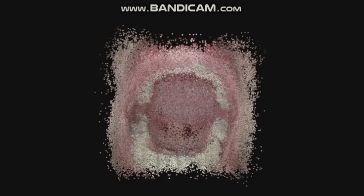
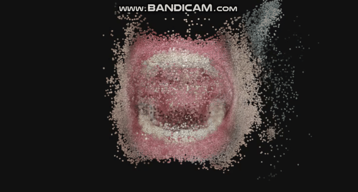
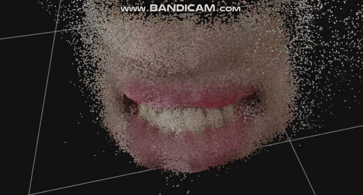
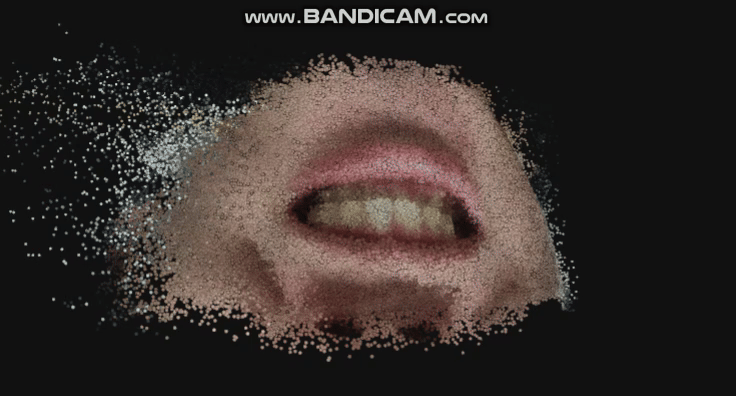
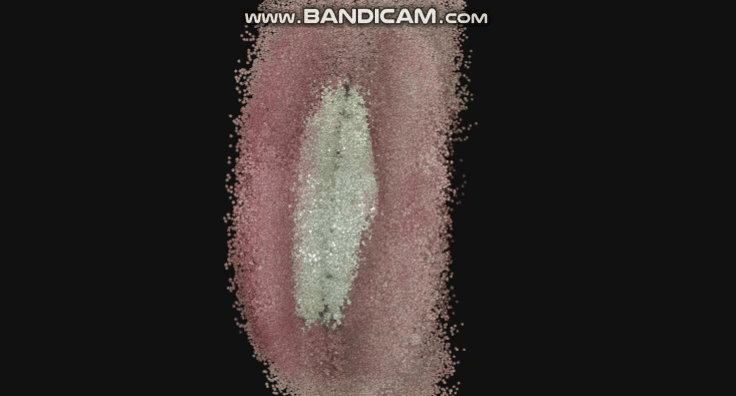

# :rocket: Project Guide :rocket:

Tooth-NVS mainly uses an end-to-end feedforward model to process captured tooth or oral videos through the following steps: (1) Extracting frames from the video to convert it into a sequence of RGB images with temporal relationships; (2) Using the vggt-x 3D geometric base model to extract camera parameters, image position and rotation parameters, and generate point cloud files; (3) Using 3DGS to jointly optimize the generated point cloud together with image camera parameters to achieve the goal of novel view synthesis (NVS). Currently, attempts are also being made to optimize using the Nope-Nerf method that does not rely on camera parameters, and the specific results are pending updates.

## :page_facing_up: 1.TODO List:page_facing_up:

- [x] 1.Complete the extended results of the Nope-Nerf parameter-free novel view synthesis method
- [x] 2.Update the project display results, including the synthesized point clouds, rendered test images, and the results of PSNR, SSIM and LPIPS metrics
- [ ] 3.Try to use mediapipe to segment the tooth area
- [ ] 4.Try using the depthanything model for point cloud reconstruction tasks

## :mag: 2.Installation :mag:

Attempt to perform operations to filter out points that deviate from the main body in the point cloud generated by [VGGT-X](https://github.com/Linketic/VGGT-X), and the nvs method based on the [3dgs](https://github.com/graphdeco-inria/gaussian-splatting) and use the depth map for joint Splatting optimization training:

```bash
git clone https://github.com/Rtwotwo/Tooth-NVS.git
mkdir logs && cd logs

# Prepare the dental data video and number it as tooth_x.mp4
python video2frames.py --video_path ./your/video/path --skip_frames 2 --frames_path ./output/tooth_x/images
python vggtx_colmap.py --scene_dir ./output/tooth_x/images --shared_camera --use_ga

# Then you can run the ./scripts/vggtx_3dgs.sh
bash ./scripts/vggtx_3dgs.sh
```

## :tada: 3.Experiment Results :tada:

We processed four sets of videos, each approximately 20 to 30 seconds long, containing data on teeth and oral cavities for novel view synthesis (NVS). Finally, we obtained a series of effect demonstrations and actual quantitative index test results, including synthesized point clouds, rendering test images, as well as PSNR, SSIM, and LPIPS index results. It can be seen that the novel view synthesis implemented using 3DGS technology performs well in terms of PSNRh and SSIM metrics, indicating low pixel-level reconstruction errors. The synthesized views are highly consistent with real images in terms of local structure, brightness, and contrast. However, in the LPIPS metric, there are phenomena such as blurriness, texture distortion, or loss of high-frequency details, which leaves room for improvement in the metric results.

During the SFM process for teeth or oral cavity, Colmap was not used for sparse reconstruction. This was mainly because, considering the reflection of teeth during video shooting and the lack of texture inside the oral cavity, Colmap might extract an insufficient number of key point matches, and it would also take a long time in the subsequent SFM process. Therefore, VGGTx was chosen to replace Colmap for the SFM work. However, as can be seen in the table below, some points in the generated point cloud deviate from the main body. These points formed high-frequency spikes and artifacts after the subsequent 3DGS rendering, so it is considered to filter them out.

| Metric       | tooth\_1(oral) | tooth\_2(oral) | tooth\_3(tooth) | tooth\_4(tooth) | tooth\_5(tooth) |
|--------------|---------------|---------------|----------------|----------------|----------------| 
| PSNR         | 29.0831       | 28.9646       | 30.4389        | 30.1718        | 28.7548        | 
| SSIM         | 0.9421        | 0.9439        | 0.9234         | 0.9251         | 0.9477         | 
| LPIPS        | 0.3912        | 0.3704        | 0.4019         | 0.4085         | 0.3847         |
|Point Cloud||||||
| 3DGS-NVS ||||||

At the same time, we also found that when the subject being photographed shakes slightly, the effect reconstructed by 3DGS will have extremely serious artifacts. Meanwhile, the corresponding PSNR, SSIM, and LPIPS indicators will also experience extremely severe declines. The specific situation can be seen in the table below. The reconstruction effect of the same five images is greatly reduced, mainly because VGGT, as an unconstrained collective 3D reconstruction model, uses the estimated camera pose of the first photo of the input model in 3D space as the world coordinate reference system, and the point clouds reconstructed from subsequent images will determine their spatial positions based on this coordinate system. Therefore, when the subject shakes, the pointmaps corresponding to different images will overlap, leading to the generation of artifacts in the NVS stage. At the same time, the number of images used in this failed case itself is relatively small, with approximately only 5 images per group.

| Metric | tooth\_0 | tooth\_1 | tooth\_2 | tooth\_3 | tooth\_4 | tooth\_5 | 
|--------|---------|---------|---------|---------|---------|---------| 
| PSNR   | 14.2085 | 13.5412 | 5.9853  | 12.3221 | 16.2400 | 9.8516  | 
| SSIM   | 0.4058  | 0.5451  | 0.0270  | 0.4459  | 0.4659  | 0.3641  | 
| LPIPS  | 0.5922  | 0.5699  | 0.6919  | 0.6054  | 0.5493  | 0.6216  |
| 3DGS-NVS |||||||

## :heart: 4.Thanks :heart:

Thanks for [VGGT-X](https://github.com/Linketic/VGGT-X) and [3dgs'](https://github.com/graphdeco-inria/gaussian-splatting) open source works. Anyway, if you want to see the trained point cloud file, you can upload your ply file to the [markkellogg](https://projects.markkellogg.org/threejs/demo_gaussian_splats_3d.php) to see the dynamic show.

